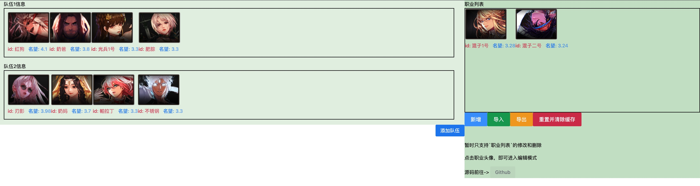

# dnf编队小工具

## 背景
和朋友组队角色太多，需要互相拖，那就分个上等马和下等马吧

后端开发，不会写css，简单实现了一下功能，有前端大佬的话，望能帮改下样式
## 环境
- `vue3` 
- ui 组件 `naive-ui` 
  - 自动引入 https://www.naiveui.com/zh-CN/os-theme/docs/import-on-demand
  - 安装插件 `pnpm i unplugin-vue-components -D` `pnpm i -D unplugin-auto-import`
- 拖拽组件 `vuedraggable` `pnpm i -S vuedraggable@next`

## 功能
- [x] 头像展示
- [x] 填写表单
- [x] 保存到缓存
- [x] 导出导入
- [x] 修改删除
- [ ] 协同修改

## 效果图

## 感谢

感谢大佬提供素材 https://github.com/dnfcalc/DNFCalculating.git

